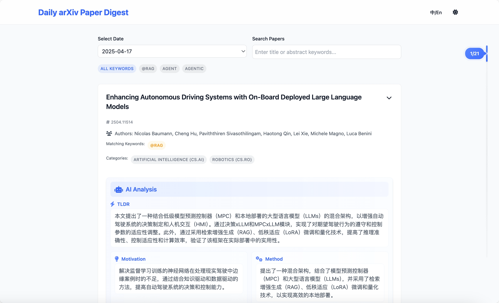

# 🔥 Your Personalized Daily arXiv Reader 
[中文版](./README.zh.md)

[](https://arxiv.org/)
[](https://deepseek.com/)
[](https://pages.github.com/)

📌 Create your own AI-curated research feed! Never miss important papers again!

## 🚀 Why This Rocks
✅ **Research on Autopilot** - Wake up to personalized paper recommendations  
✅ **AI-Powered Insights** - Get TL;DR summaries in your preferred language  
✅ **Fully Customizable** - Like building your own arXiv with LEGO blocks  
✅ **Zero Maintenance** - Fully automated with GitHub Actions

## ⚡ Quick Start
```bash
# Clone & Run in 60 seconds!
git clone https://github.com/your-repo/daily-arXiv-ai-enhanced.git
cd daily-arXiv-ai-enhanced
uv sync
./run.sh --debug
```

## 🌟 Feature Highlights
| 🛠️ Customization | 🔍 Smart Search | 🚀 Deployment |
|-------------------|-----------------|---------------|
| Choose categories | Semantic search | Local dev     |
| Set keywords      | Full-text filter| GitHub Pages  |
| Pick AI models    | Date filtering  | Auto-updates  |

## 🎯 Perfect For
- 🧠 ML Researchers tracking SOTA
- 🎓 Grad students building literature review
- 🤖 AI Engineers staying updated
- 📚 Anyone tired of arXiv overload!

## 📸 See It in Action


## Features

- **Fully Customizable Research Feed**
  - Choose exactly which arXiv categories interest you
  - Filter papers using your own keywords and criteria
  - Set your preferred language for AI-generated summaries
  - Select your favorite AI model for summarization

- **Smart Paper Discovery**
  - Daily automatic updates of relevant papers
  - AI-powered paper summarization tailored to your interests
  - Advanced search functionality across all your curated papers
  - Category-based organization for easy navigation

- **Flexible Deployment**
  - Run locally for personal use
  - Deploy via GitHub Pages for public sharing
  - GitHub Actions automation for hands-off operation
  - Easy debugging and customization options

## How to Use

### Web Interface
Visit the GitHub Pages site to view your personalized paper feed and summaries.

### Local Development
1. Clone this repository
2. Install dependencies:
   ```bash
   uv sync
   ```
3. Customize your experience with environment variables:
   ```bash
   export CATEGORIES="cs.CV,cs.CL"  # Your preferred arXiv categories
   export KEYWORDS="deep learning,neural network"  # Your custom keywords
   export LANGUAGE="Chinese"  # Your preferred summary language
   export MODEL_NAME="deepseek-chat"  # Your chosen AI model
   ```
4. For local development:
   ```bash
   ./run.sh --debug
   ```
   This will start your personalized server at http://localhost:8000

### GitHub Actions
Set up your automated research feed:

1. Go to your repository's Settings -> Secrets and variables -> Actions
2. Add the following secrets:
   - `OPENAI_API_KEY`
   - `OPENAI_BASE_URL`
3. Configure your preferences with these variables:
   - `CATEGORIES`: Your chosen arXiv categories (e.g., `cs.CV,cs.CL,cs.AI`)
   - `KEYWORDS`: Your custom keywords (add @ prefix for case_sensitive) (e.g., `Agent,Agentic,@RAG`)
   - `LANGUAGE`: Your preferred summary language (e.g., `Chinese` or `English`)
   - `MODEL_NAME`: Your selected AI model (e.g., `deepseek-chat`)
   - `EMAIL`: Your email for git commits
   - `NAME`: Your name for git commits

## Acknowledge

- Thanks for [dw-dengwei/daily-arXiv-ai-enhanced](https://github.com/dw-dengwei/daily-arXiv-ai-enhanced)
