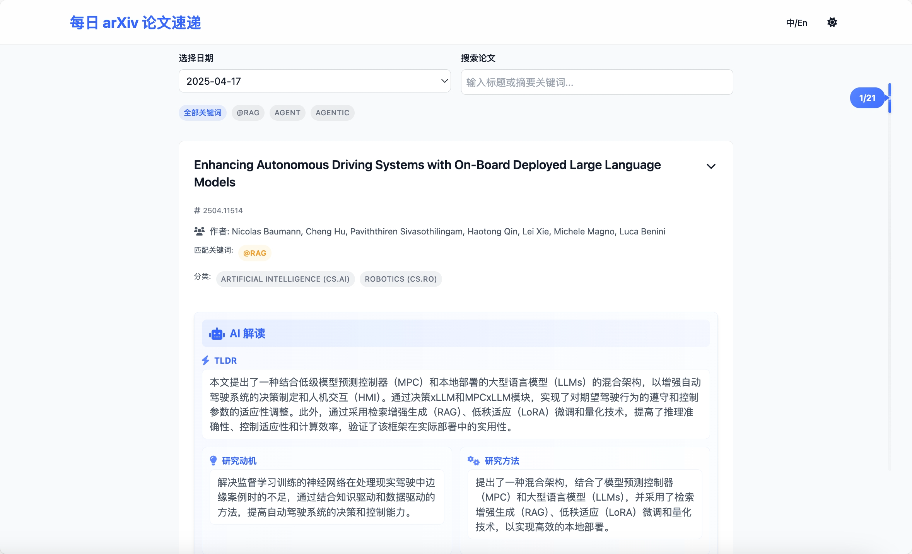

# 🔥 你的智能arXiv每日阅读器
[English](./README.md)

[](https://arxiv.org/)
[](https://deepseek.com/)
[](https://pages.github.com/)

📌 创建你的AI精选科研资讯流，重要论文不再错过！

## 🚀 核心优势
✅ **全自动科研助手** - 每日推送个性化论文推荐  
✅ **AI深度解析** - 母语级论文摘要一键生成  
✅ **高度可定制** - 像搭积木一样打造专属arXiv  
✅ **零运维成本** - GitHub Actions全自动运行

## ⚡ 极速体验
```bash
# 三步开启智能阅读！
git clone https://github.com/your-repo/daily-arXiv-ai-enhanced.git
cd daily-arXiv-ai-enhanced
uv sync
./run.sh --debug
```

## 🌟 火爆功能
| 🛠️ 深度定制 | 🔍 智能搜索 | 🚀 一键部署 |
|-------------|-------------|-------------|
| 领域精准筛选 | 语义搜索    | 本地开发    |
| 关键词过滤   | 全文检索    | GitHub Pages|
| AI模型任选   | 时间过滤    | 自动更新    |

## 🎯 适合人群
- 🧠 追踪前沿的ML研究者
- 🎓 构建文献综述的研究生
- 🤖 保持技术敏感的工程师
- 📚 受困于信息过载的学者

## 📸 效果预览


## 功能特点

- **完全可定制的研究资讯流**
  - 自由选择感兴趣的arXiv类别
  - 使用自定义关键词和条件筛选论文
  - 设置您偏好的摘要语言
  - 选择您喜欢的AI模型进行摘要生成

- **智能论文发现**
  - 每日自动更新相关论文
  - 基于您兴趣的AI论文摘要
  - 强大的搜索功能，覆盖所有精选论文
  - 基于类别的组织方式，轻松导航

- **灵活的部署方式**
  - 本地运行，个人使用
  - 通过GitHub Pages部署，公开分享
  - GitHub Actions自动化，无需手动操作
  - 易于调试和定制

## 使用方法

### Web界面
访问GitHub Pages站点查看您的个性化论文资讯流和摘要。

### 本地开发
1. 克隆此仓库
2. 安装依赖:
   ```bash
   uv sync
   ```
3. 通过环境变量定制您的体验:
   ```bash
   export CATEGORIES="cs.CV,cs.CL"  # 您偏好的arXiv类别
   export KEYWORDS="deep learning,neural network"  # 您的自定义关键词
   export LANGUAGE="Chinese"  # 您偏好的摘要语言
   export MODEL_NAME="deepseek-chat"  # 您选择的AI模型
   ```
4. 本地开发:
   ```bash
   ./run.sh --debug
   ```
   这将在http://localhost:8000启动您的个性化服务器

### GitHub Actions
设置您的自动化研究资讯流:

1. 前往仓库的Settings -> Secrets and variables -> Actions
2. 添加以下secrets:
   - `OPENAI_API_KEY`
   - `OPENAI_BASE_URL`
3. 通过以下变量配置您的偏好:
   - `CATEGORIES`: 您选择的arXiv类别（例如，`cs.CV,cs.CL,cs.AI`）
   - `KEYWORDS`: 您的自定义关键词（添加@前缀表示大小写敏感）（例如，`Agent,Agentic,@RAG`）
   - `LANGUAGE`: 您偏好的摘要语言（例如，"Chinese"或"English"）
   - `MODEL_NAME`: 您选择的AI模型（例如，`deepseek-chat`）
   - `EMAIL`: 用于git提交的邮箱
   - `NAME`: 用于git提交的名字

## 致谢

- 感谢[dw-dengwei/daily-arXiv-ai-enhanced](https://github.com/dw-dengwei/daily-arXiv-ai-enhanced) 